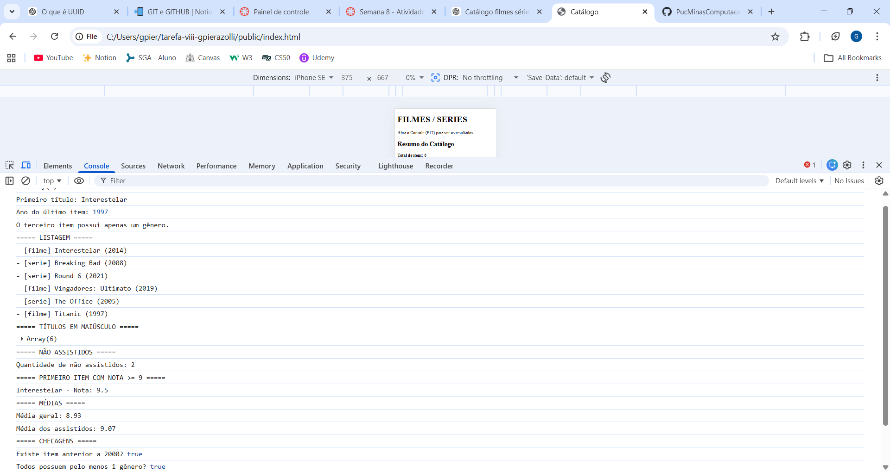

## Informações Gerais
- Nome: Gabriela Pinheiro Pierazolli
- Matricula: 1580351

## Descrição
Projeto desenvolvido em JavaScript utilizando:
- JSON
- Arrays
- Iterators
- forEach
- map
- filter
- find
- reduce
- some
- every
- Manipulação do DOM

## Imagem do exercício

